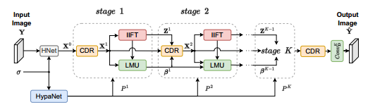

# TDU-DLNet
## TDU-DLNet: A Transformer-Based Deep Unfolding Network for Dictionary Learning
Kai Wu, Jing Dong, Guifu Hu, Chang Liu, Wenwu Wang, Senior Member, IEEE


<hr />

> **Abstract:** *Deep unfolding attempts to leverage the interpretability of traditional model-based algorithms and the learning ability of deep neural networks by unrolling model-based algorithms as neural networks. Following the framework of deep unfolding, some conventional dictionary learning algorithms have been expanded as networks. However, earlier deep unfolding networks for dictionary learning use handcrafted priors. Though deep unfolding methods proposed in recent years learn priors from data, they usually employ convolutional neural networks which have limited receptive fields. To address these issues, we propose a transformer-based deep unfolding network for dictionary learning (TDU-DLNet). The network is developed by unrolling a general formulation of dictionary learning with an implicit prior formed from representation coefficients. The prior is learned by a transformer-based network where an inter-stage feature fusion module is introduced to decrease information loss among stages. The effectiveness and superiority of the proposed method are validated on image denoising. Experiments based on widely used datasets demonstrate that the proposed method achieves competitive results with fewer parameters as compared with deep learning and other deep unfolding methods.* 
<hr />


## Network Architecture


Download pretrained models from https://pan.baidu.com/s/149jPme5JyTv3BzB8cQrLRQ?
(password: 11v5).
Unzip downloaded file and put the folders into ./model_save

## Demo

To test the pre-trained TDU-DLNet modelson your own images, you can run the follow demo:

```
python test.py 
```
To retrain the TDU-DLNet model on your own images, you can run the following demo:
```
python train.py 
```
Description of relevant options in the test and training Settings file (test_options.json train_options.json)
- **`n_channels`**
The number of channels tested or trained is 3 for color images and 1 for grayscale images


## Thank you for the following work.
- Restormer: https://github.com/swz30/Restormer
- DGUNet: https://github.com/MC-E/DGUNet
- DCDicL: https://github.com/natezhenghy/DCDicL_denoising


